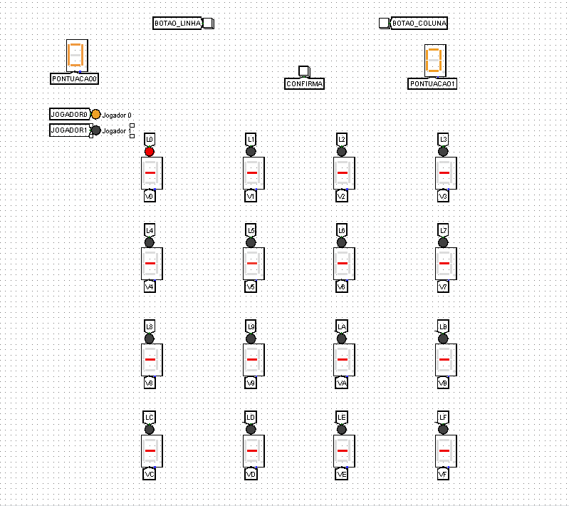
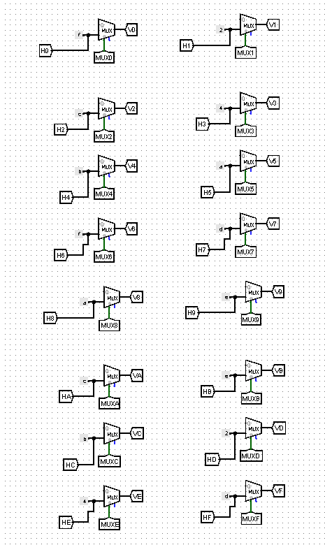
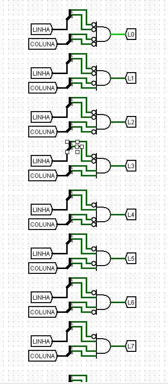
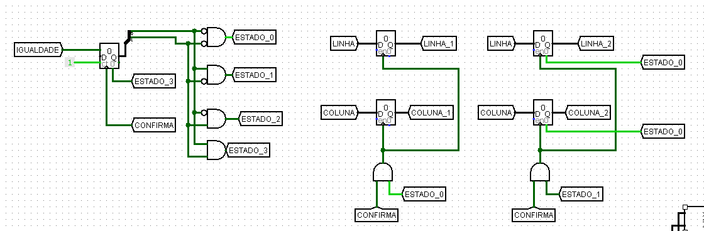
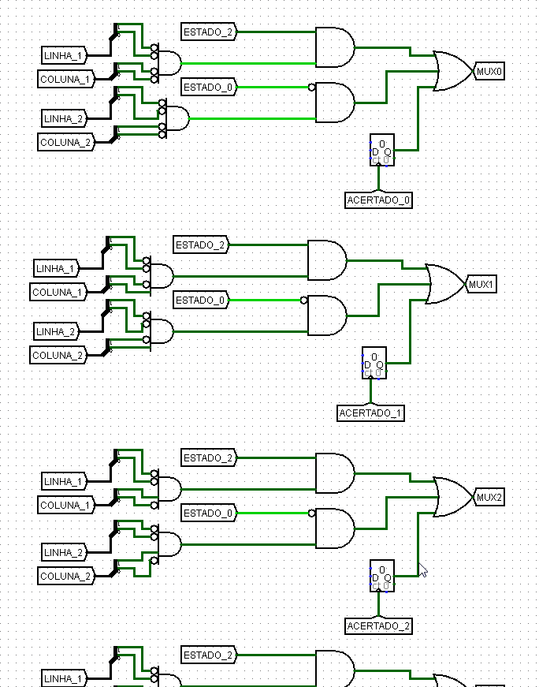
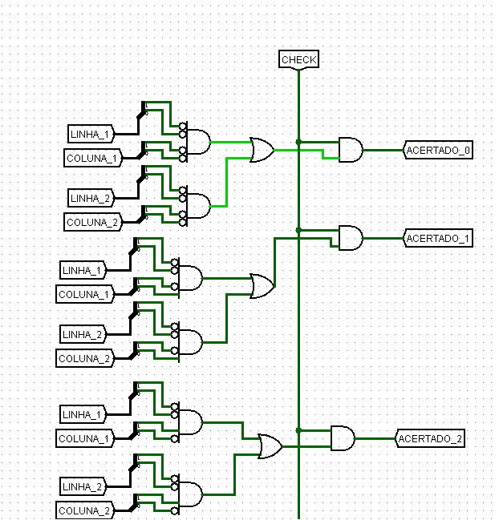
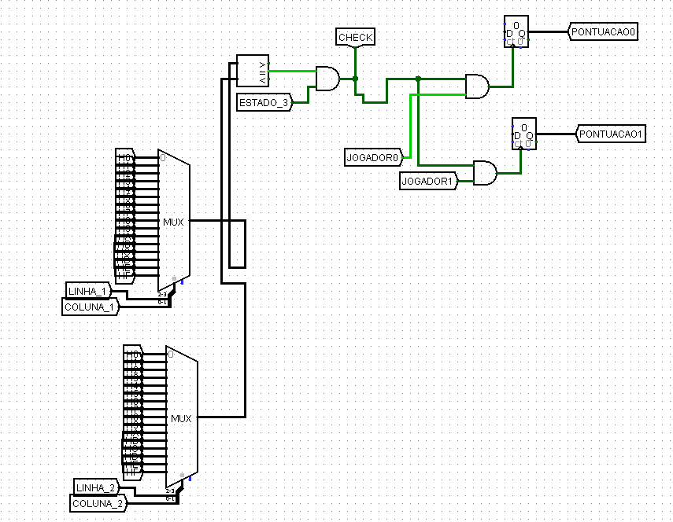
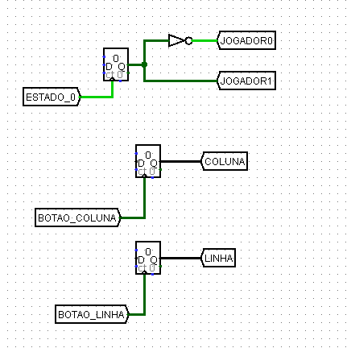
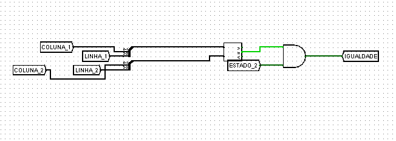

## Interface Principal

## Introdução

 O relatório descreve a construção de um jogo da memória para dois jogadores, implementado em um tabuleiro 4x4 utilizando o simulador Logisim.
O tabuleiro é composto por displays de 7 segmentos (hexadecimal), que exibem números em formato hexadecimal, inicialmente ocultos.
Durante o jogo, os jogadores revelam dois displays por vez, buscando pares iguais. A interação é realizada por meio de botões para selecionar linhas e colunas,
proporcionando uma experiência dinâmica.

## Objetivo

O objetivo do projeto é apresentar os detalhes da construção de um jogo da memória para dois jogadores, 
implementado em um tabuleiro 4x4 utilizando o simulador Logisim. Adicionalmente, o trabalho visa explorar os conceitos
abordados na disciplina de Circuitos Digitais, aplicando-os na prática para a criação de um sistema funcional e interativo.

## Componentes Utilizados

### Multiplexadores Controlados

O sistema usa multiplexadores para controlar displays 4x4 que permite o uso dinâmico ddos displays durante o jogo.

### Inserção dos LEDs de seleção

O circuito permite a seleção de displays através de botões que alternam entre as linhas e as colunas. 
O sistema possibilita a navegação entre as opções de displays, com base nas entradas dos botões, controlando a ativação dos LEDs conforme a posição selecionada.
Para isso, foram utilizados túneis conectados aos LEDs correspondentes, permitindo que a escolha de linha
e coluna seja refletida na ativação dos LEDs específicos garantindo uma navegação intuitiva e eficiente pelo sistema.

### Escolhendo os Displays

O circuito usa o conceito de máquina de estados para controlar a seleção e exibição de diplays.
Os registradores armazenam as posições dos displays escolhidos, e as transições ocorrem ao pressionar o botão CONFIRMA.

### Exibição dos displays

O circuito controla a exibição de um display com base em situações específicas.
As condições são avaliadas por contadores e multiplexadores que determinam se o valor do display será mostrado.

### Visualização de pares

O circuito implementa a lógica de pontuação e visibilidade no jogo de pares. Ele é composto por túneis referentes as linhas e colunas
portas lógicas (AND, NOR) e contadores.

### Atualização de pontuação

O sistema compara as escolhas do jogador. Se forem iguais, a pontuação é aumentada e o display é mantido visível.
O circuito utiliza contadores para registrar a linha e a coluna dos displays selecionados e um comparador 
para verificar se as posições dos dois displays selecionados são iguais.

### Contagem individual

O circuito foi implementado com o objetivo de garantir a contagem individual de pontos de dois jogadores. Para isso foi utilizado
contadores e uma porta NOT ligado no túnel referente ao jogador 0. 

### Igualdade

O circuito garante que a igualdade entre as pontuações seja efetiva.

## Conclusão 

O projeto do jogo da memória digital foi concluído com sucesso, atendendo a todos os requisitos propostos.
A implementação utilizou de forma eficiente circuitos sequenciais e combinacionais, como registradores, multiplexadores,
contadores e portas lógicas (AND, NOT). O uso estratégico de túneis foi fundamental para otimizar a lógica dos circuitos, garantindo maior praticidade e eficiência.
O jogo permite a seleção de displays, validação de pares e contagem de pontos, evidenciando a aplicação prática dos conceitos de circuitos digitais.
A interface, composta por LEDs para a indicação dos turnos e displays de 7 segmentos para as pontuações, operou de maneira clara e objetiva, 
cumprindo de forma eficaz os objetivos do projeto.
